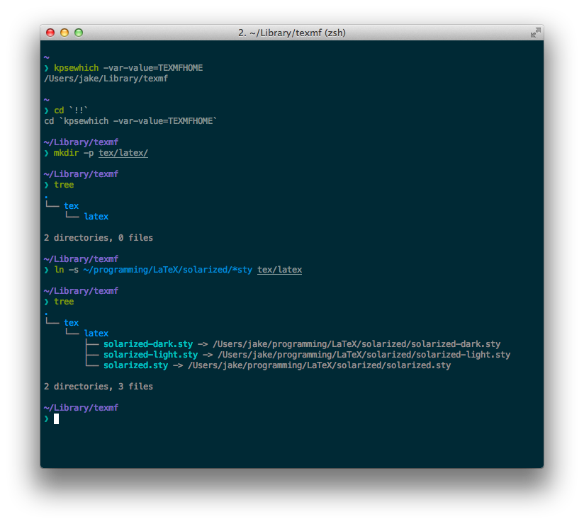

# Solarized LaTeX Listings

This provides three LaTeX packages using the [Solarized][solarized] theme with the LaTeX `listings` package for code listings. It just defines Solarized [color codes][colors] and provides two packages, `solarized-light` and `solarized-dark`, for changing the colors of the listings.

## Download

First off, fork and clone (or simply clone) the repository:

```bash
# If you forked:
$ git clone https://github.com/<your-username>/latex-solarized.git

# If you didn't
$ git clone https://github.com/jez/latex-solarized.git
```

This is entirely up to you, but I like to keep all my LaTeX files in one place, a folder called `~/programming/LaTeX/`, so I'd clone into this folder. You should choose a location that make sense to you.

Next up, we need to tell LaTeX where it can find the files we just cloned. Normally, the process would be to copy these files into a specific folder for LaTeX. However, this has a couple disadvantages, most notably that it makes updating a pain. Instead, we're going to symlink these files into place. If you've never heard about symlinks, you may want to [read up about them][symlinks], and checkout `man ln` (the man page for the command used to create links).

## Installation

LaTeX package files need to be placed in a machine-dependent location in order for them to be usable with `\usepackage{}`. This location varies, but you can use the command `kpsewhich -var-value=TEXMFHOME` to figure out what the root folder is for your machine. If this command didn't work, you might have a non-standard installation of LaTeX. [Check here][latex-packages] for more help.

Within the folder returned by `kpeswhich`, you'll need to create the folder `tex/latex/`, and then create the links with `ln -s <path-to-your-clone>/*sty tex/latex/`.

__Note__: the following example uses a) the path where I personally installed latex-solarized, and b) the command `tree` which just lists directory contents. This command might not be available, but it's not necessary.



## Usage

Now you're all set! You should be able include `\usepackage{solarized-light}` or `\usepackage{solarized-dark}` to start using Solarized colors with your LaTeX code listings. You might also want to read up on LaTeX code listings [here][wiki] and [here][manual].

## Example

There are some examples in the [examples/](examples) folder.


## Known Issues

When using the dark theme, if the line spacing isn't quite right, you will get thin lines of from the page background showing between the lines of the listing. There are some solutions outlined [here][lines], but none were easily incorporated into this package.

## License

MIT License. See [LICENSE](LICENSE).

[solarized]: http://ethanschoonover.com/solarized
[colors]: solarized.sty
[symlinks]: https://kb.iu.edu/d/abbe
[latex-packages]: http://tex.stackexchange.com/a/1167
[lines]: http://stackoverflow.com/questions/3374151/stripes-in-background-color-drawn-by-listings-package
[wiki]: http://en.wikibooks.org/wiki/LaTeX/Source_Code_Listings
[manual]: http://texdoc.net/texmf-dist/doc/latex/listings/listings.pdf
